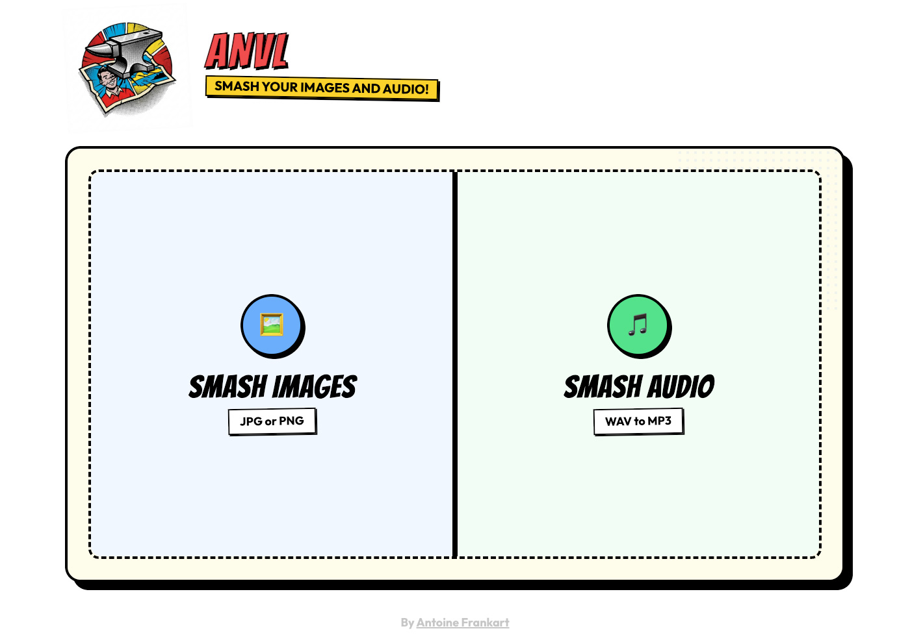
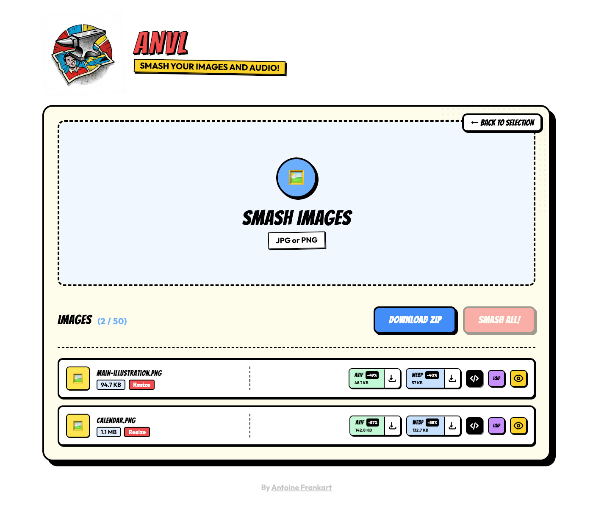

# 🔨 ANVL - Image & Audio Optimizer

**ANVL** is a web application designed to "smash" your media into highly optimized formats, in a Pop Art-styled interface. It converts standard **images** (JPG, PNG) into modern AVIF/WebP formats and **audio** (WAV) into optimized MP3s.

The **Client** application is built with **Nuxt 4** and **TailwindCSS**.
The **Server** application is built with **Node.js** and **Express**.



## ✨ Features

### 🖼️ Image Smasher
- **Drag & Drop**: Upload up to 50 images (JPG/PNG).
- **Dual Conversion**: Generates **AVIF** and **WebP** versions automatically.
- **Resizing**: Custom Width/Height and Quality settings.
- **Preview Mode**: "Before/After" slider to compare visual quality.
- **Code Snippets**: Copy ready-to-use `<picture>` tags or LQIP placeholders.

### 🎵 Audio Smasher
- **WAV to MP3**: Convert heavy WAV files into lightweight MP3s.
- **Configuration**:
    - **Bitrate**: Choose between 128k, 192k, or 320k.
    - **Channels**: Mix down to Mono or keep Stereo.
    - **Speed Control**: Adjust playback speed from **0.5x** to **1.5x**.

### ⚡ General
- **Batch Processing**: "Smash" everything at once.
- **Batch Download**: Get all results in a single ZIP file.
- **Pop Art Design**: Vibrant UI with bold animations.




## 🚀 Getting Started

### Prerequisites

- Node.js (v18+ recommended)
- **ffmpeg** must be installed on your system for Audio processing.

### Installation

Install dependencies for the entire project (root, client, and server):
```bash
npm install
```

### Running the Application

Start both client and server:

```bash
npm run dev
```

- **Client**: `http://localhost:3000`
- **Server**: `http://localhost:4000`

## 📖 Usage

1. **Select Mode**: Choose **"SMASH IMAGES"** or **"SMASH AUDIO"** from the split screen.
2. **Upload**: Drag & drop your files.
3. **Configure**:
    - **Images**: Click "Resize" to adjust dimensions/quality.
    - **Audio**: Click "Configure" to set Bitrate, Channels, or Speed.
4. **Smash**: Click the main action button (e.g., "SMASH ALL IMAGES").
5. **Download**: Grab individual files or download the full ZIP.