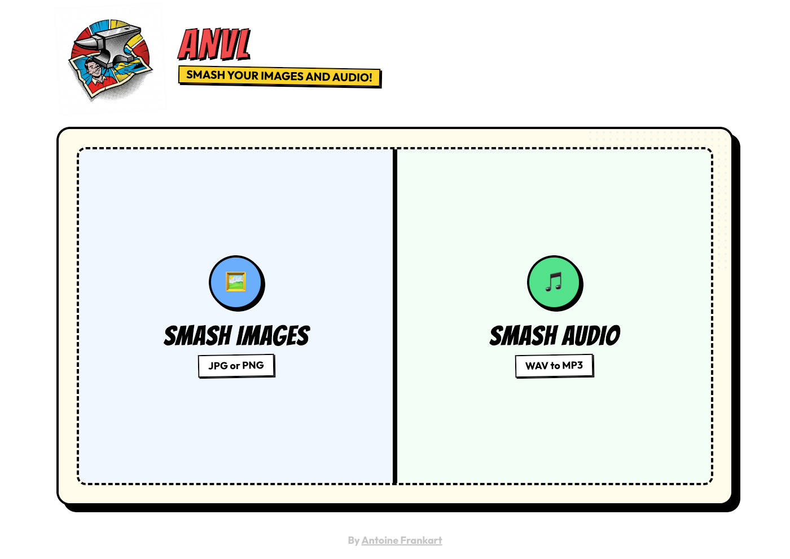
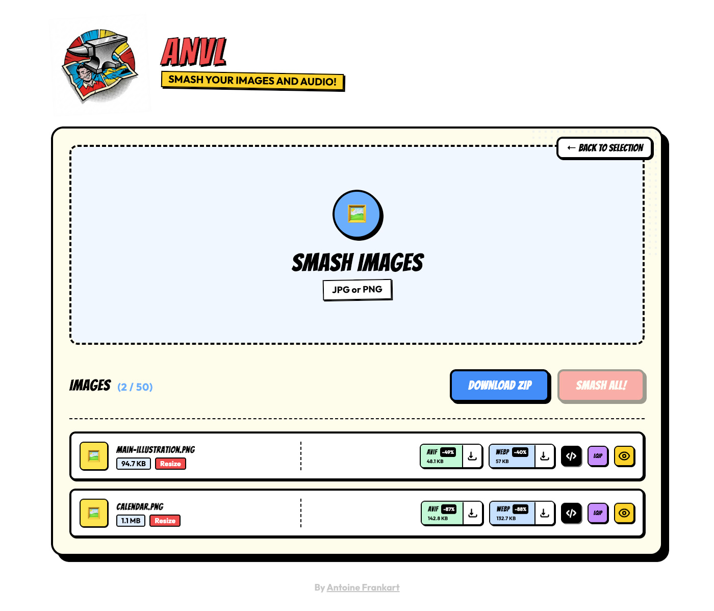

# 🔨 ANVL - Image & Audio Optimizer

**ANVL** is a web application designed to "smash" your media into highly optimized formats, in a Pop Art-styled interface. It converts standard **images** (JPG, PNG) into modern AVIF/WebP formats and **audio** (WAV) into optimized MP3s.

The **Client** application is built with **Nuxt 4** and **TailwindCSS**.
The **Server** application is built with **Node.js** and **Express**.



## ✨ Features

### 🖼️ Image Smasher

- **Drag & Drop**: Upload up to 50 images (JPG/PNG).
- **Dual Conversion**: Generates **AVIF** and **WebP** versions automatically.
- **Resizing**: Custom Width/Height and Quality settings.
- **Preview Mode**: "Before/After" slider to compare visual quality.
- **Code Snippets**: Copy ready-to-use `<picture>` tags or LQIP placeholders.

### 🎵 Audio Smasher

- **WAV to MP3**: Convert heavy WAV files into lightweight MP3s.
- **Configuration**:
  - **Bitrate**: Choose between 128k, 192k, or 320k.
  - **Channels**: Mix down to Mono or keep Stereo.
  - **Speed Control**: Adjust playback speed from **0.5x** to **1.5x**.

### ⚡ General

- **Batch Processing**: "Smash" everything at once.
- **Batch Download**: Get all results in a single ZIP file.
- **Pop Art Design**: Vibrant UI with bold animations.



## 🚀 Getting Started

### Prerequisites

- Node.js (v18+ recommended)
- **ffmpeg** must be installed on your system for Audio processing.
- To build the local macOS app: Zig 0.16+, clang, `ditto`, and the `zero-native` CLI.

### Installation

Install dependencies for the entire project (root, client, and server):

```bash
npm install
```

### Running the Application

Start both client and server:

```bash
npm run dev
```

- **Client**: `http://127.0.0.1:4350`
- **Nuxt HMR**: `127.0.0.1:4351`
- **Server**: `http://127.0.0.1:4000`

### Running the local macOS app

ANVL includes a Zero Native desktop shell for local macOS use.

```bash
npm run dev:mac
```

To create a local Dock launcher:

```bash
npm run mac:launcher
```

Then open `dist/ANVL.app` from Finder and keep it in the Dock if desired.

The generated app bundles the Zero Native shell, Node.js, the Nuxt client, the
Express server, and installed dependencies. At launch it copies that runtime into
`~/Library/Application Support/ANVL/runtime.*` and runs from there, which lets the
app work even when the `.app` is moved outside the repository or copied to another
Mac with the same CPU architecture.

Notes:

- Build tools are required only to create `dist/ANVL.app`; they are not required to run it.
- The generated app is unsigned and not notarized.
- Rebuild the app with `npm run mac:launcher` after changing client, server, desktop, or dependency code.
- The generated `dist/ANVL.app` is ignored by git and can be recreated at any time.
- Launcher logs are written to `~/Library/Logs/dev.anvl.local/launcher.log`.
- Native downloads are saved to `~/Downloads`.

## 📖 Usage

1. **Select Mode**: Choose **"SMASH IMAGES"** or **"SMASH AUDIO"** from the split screen.
2. **Upload**: Drag & drop your files.
3. **Configure**:
   - **Images**: Click "Resize" to adjust dimensions/quality.
   - **Audio**: Click "Configure" to set Bitrate, Channels, or Speed.
4. **Smash**: Click the main action button (e.g., "SMASH ALL IMAGES").
5. **Download**: Grab individual files or download the full ZIP.
